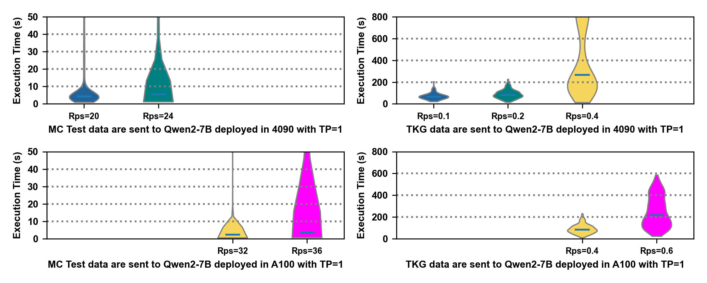

# LLMPerf: In-Depth Performance Analysis of LLM Services on GPU Cloud Environments

LLMPerf is an open-source project designed to deliver comprehensive, ready-to-use insights into the performance of Large
Language Model (LLM) services.
Through in-depth performance evaluations, LLMPerf provides benchmarking results that developers, researchers, and
engineers can immediately use to understand the effects of different deployment strategies on LLM performance.

This project focuses on key performance metrics such as latency, throughput, and resource utilization.
LLMPerf’s data-driven insights are particularly valuable for optimizing large-scale LLM serving environments, ensuring
efficiency and stability in production settings.

## Introduction

LLMPerf evaluates the performance of LLM services across various hardware configurations and inference scenarios,
offering a clear, real-world analysis of different workloads.

#### Experimental Setup

* **Model**
    * Qwen2-7B
    * Qwen2-72B-AWQ
* **GPU**
    * 4090 24 GB × 8, PCIe Gen4.0
    * A100 80 GB × 8, NVLink, PCIe Gen4.0
* **Testing Task**
    * MC (Multiple Choice) TEST: Focuses on small prompt and generation tokens, with minimal network overhead.
    * TKG (Temporal Knowledge Graph Extraction): Handles large prompt and generation tokens, stressing gpu memory for kv
      cache and in-host network capacity.
* **Request Injection**: Poisson Distribution
* **Injection Time**: 15 min per experiment

#### Evaluation Metric

* The **execution time** distribution: This metric monitors the distribution of request execution times. Anomalies in
  this distribution indicate that the LLM service may be struggling to process requests efficiently, revealing
  performance bottlenecks under high loads.

This setup allows us to examine the behavior of LLM services across different usage patterns and GPU infrastructures,
with a focus on GPU utilization, inference framework performance, and network bottlenecks.

## In-Depth Performance Analysis of LLM Services

### 1. GPU Performance Analysis

The GPU analysis Focuses on the following factors:

* **Computing Capacity**: The computing capacity difference of GPUs root in FP64/FP32/BF16/FP16/INT8 tensor cores.
* **GPU Memory and Bandwidth**:
    * 4090: 24 GB Memory and 1 TB/s Bandwidth.
    * A100: 80 GB Memory and 2 TB/s Bandwidth.
* **Interconnect**:
    * 4090: PCIe Gen4 2 GB/s × 16 (32 GB/s per GPU)
    * A100: NVLink 25 GB/s × 12 (300 GB/s per GPU)

#### 1.1 Performance Inside GPU

To evaluate the performance within a single GPU, **Qwen2-7B** was deployed on one GPU (with tensor parallel size = 1),
and service performance was tested using requests from the MC Test and TKG datasets.

* **MC Test dataset**: Qwen2-7B deployed on an A100 processed **1.6× more requests** than on a 4090.
  This difference is due to the superior computing capacity and higher GPU bandwidth of the A100.

* **TKG dataset**: Qwen2-7B deployed on an A100 processed **2× to 3× more requests** than on a 4090.
  The 4090’s limited GPU memory results in an inability to store cached Key and Value tokens, reducing the number of
  simultaneous requests.
  This leads to under-utilization of the 4090’s computing capacity.

**Conclusion**:
Optimizing GPU selection and configuration for LLMs is a memory-bound challenge. Insufficient GPU memory significantly
impacts LLM service performance.

The performance differences are visually presented below:

#### 1.2 Performance of Interconnected GPUs

To evaluate the performance of interconnected GPUs, **Qwen2-72B-AWQ** was deployed on four GPUs (with tensor parallel
size = 4).
The tokens stored in GPU memory would be transferred between GPUs during the serving process.
Then service performance was tested using requests from the MC Test and TKG datasets.

* **MC Test dataset**: Qwen2-7B deployed on A100 processed **1.6× more requests** than on 4090, which is consistent with
  the performance of Qwen2-7B deployed in one single GPU.
* **TKG dataset**: Qwen2-7B deployed on A100 processed **3× to 4× more requests** than on 4090, while GPU memory was
  enough for KV cache.
  This bottleneck root in the in-host communication between interconnected GPUs.

**Conclusion**:
Optimizing GPU configuration for LLMs is both a memory-bound and in-host communication-bound challenge.
As long as the cached tokens on one GPU do not exceed a certain threshold, there will be no in-host communication
bottleneck.
This observation provides a basis for recommending different GPU configurations depending on model size and task type.
For instance, Qwen2-72B can be deployed on 4090 GPUs for tasks with lower token loads, but for tasks with large prompts,
deploying on 4090 is not ideal due to memory constraints.

Performance differences between GPUs are visually presented below:

### 2. Inference Framework Performance Analysis

The inference framework analysis provides critical insights into selecting the optimal framework for deploying LLM
services.
We evaluate core optimization strategies proposed by inference frameworks and compare their impact on performance.

#### 2.1 Inference Optimization Toolkits

**A. RadixAttention**

In existing inference engines, the KV cache of a request is discarded after processing is completed, preventing the KV
cache from being reused across multiple calls and significantly slowing down the execution.
**RadixAttention** enables the automatic reuse of the KV cache across multiple generation calls.

The experiment aims to compare the performance of the same testing task under identical experimental conditions,
executed once before (like TPS=6 P) and once after (like TPS=6 L) a specific time period.

* **Before**: This first stage represents the KV cache dictionary construction process.
* **After**: KV cache automatically constructed during the first stage is reused for subsequent calls.

**Conclusion**:
RadixAttention does not directly reduce the execution time of requests sent to llm service (generation process), but
enhance the throughput by accelerating prefill batch.
Therefore, with RadixAttention, llm services can process more requests per second, while the execution time will not be
reduced if the incoming request rate remains below the system’s throughput limit.

Performance differences are visually presented below:

**B. To be updated**

#### 2.2 Inference Framework Comparison

We compared the performance of two open-source inference acceleration frameworks, sglang and vllm.

**Conclusion**:
The **sglang** framework demonstrated superior acceleration performance in the tested scenarios.

Performance differences between inference frameworks are visually presented below:

### 3. LLM Service Performance Analysis

The llm service analysis focuses on the following factors:

* **Determining Tensor Parallel Size**
* **Scaling Up Instances in One Host**
* **Scaling Up Instances in One GPU**

#### 3.1 Determining Tensor Parallel Size

Increasing the tensor parallel size allows Large Language Model (LLM) computations to be distributed across multiple GPUs, but it also introduces additional resource overhead. 
The key consideration is whether increasing tensor parallel size leads to proportional improvements in service performance. 
Finding the optimal balance is essential to avoid inefficient GPU resource utilization.

The experimental results have shown that the LLM service can process more requests, as the tensor parallel size increases. However, the increase is not proportional to the increase in GPU resources.

**Conclusion**:
Instead of considering increasing tensor parallel size for computing performance, we determine the size based on whether the GPU memory is sufficient to store prompt and generation tokens for KV caching.

Performance differences between different tensor parallel sizes are visually presented below:

 

#### 3.2 Scaling Up Instances in One Host

When building a GPU cluster and deploying LLM services, we need to analyze whether services will interfere with each other and affect performance when deploying multiple models on a single GPU host.

**Conclusion**:
Nearly no influence on service performance when multiple LLM service instances deployed on one GPU Host.

Performance differences are visually presented below:

#### 3.3 Scaling Up Instances in One GPU

#### 3.4 To Be Updated
